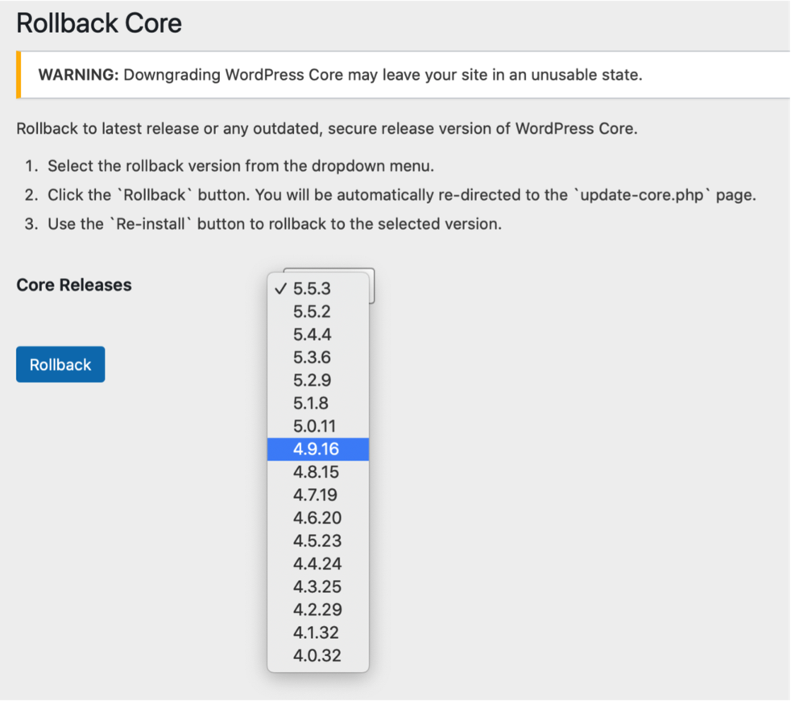

# Core Rollback

 * Author:            Andy Fragen
 * Author URI:        https://github.com/afragen
 * Donate link:       https://thefragens.com/github-updater-donate
 * License:           MIT
 * Requires PHP:      5.6
 * Requires at least: 4.1

## Description

Seamless rollback of WordPress Core to latest release or any outdated, secure release using the Core Update API and core update methods. Only latest release and outdated, secure releases are offered.

Refer to https://api.wordpress.org/core/stable-check/1.0/

Logo from a meme generator. [Original artwork](http://hyperboleandahalf.blogspot.com/2010/06/this-is-why-ill-never-be-adult.html) by Allie Brosh.

## Usage

From the Tools menu select `Rollback Core`, select the version you wish to rollback to from the dropdown and click `Rollback`. You will be directed to the `update-core.php` page where you should see a button to `Re-install` your specified version. If you move away from the `update-core.php` page before clicking the `Re-install` button you will have 15 seconds to return and complete the process or you will need to start over.

In multisite use the Settings menu.

**WARNING:** Downgrading WordPress Core may leave your site in an unusable state requiring a complete reinstall or a forced reinstall using WP-CLI, `wp core update --force --version=5.5.3`. It may also leave your site broken due to a plugin or theme incompatibility. **Use at your own risk.**

Rollbacks use your current locale.

PRs are welcome.

## Screenshots

### 1. Tools menu item

### 2. Rollback Core action dropdown

### 3. Re-install Now button for rollback

